# PiDisplay

**A customizable touch dashboard for a wall-mounted Raspberry Pi.**

Weather, calendars, to-do lists, timers, reminders, stocks, news, photos, Spotify, YouTube on your TV and more on one always-on touchscreen, with pages that rotate on their own, tiles you can drag and resize right on the screen, and offline voice control. Built for a Raspberry Pi 4 driving a 15.6" 1080p touchscreen, and it runs in any browser.

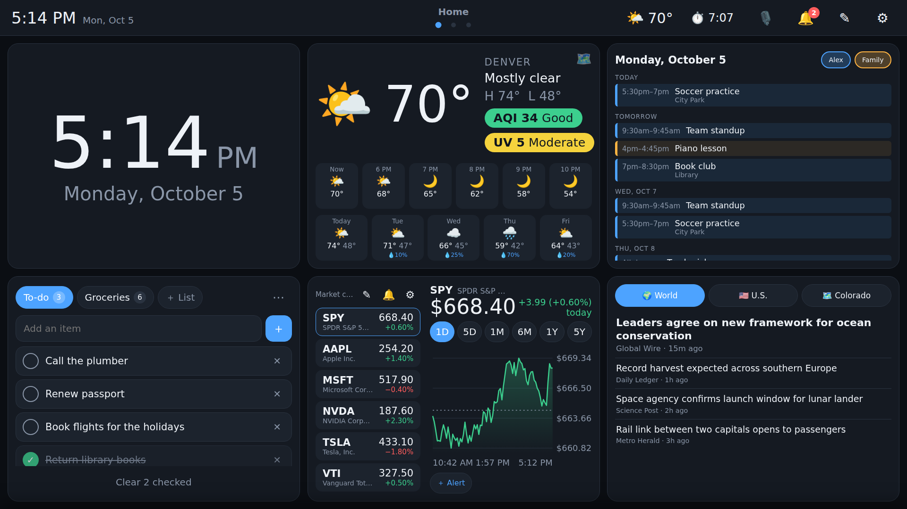

<sub>All screenshots use demo data.</sub>

## Highlights

- **Touch-first layout.** Pages of tiles on a 6×4 grid that rotate on a timer or swipe left and right. Touching the screen pauses the rotation for a while.
- **Edit on the screen itself.** Tap ✎ to drag tiles around, cycle through nine tile sizes, change a widget's settings, and add pages. Everything saves to the Pi straight away, and another screen (say, a phone on the same network) picks the change up instantly.
- **A persistent top bar** with the clock, current weather, running timers, a 🎙️ voice button and a 🔔 notification bell.
- **Plugin-style widgets.** Each widget is one self-contained folder; adding a feature means dropping in a new folder. See [Writing a widget](docs/WIDGETS.md).
- **Server-side reliability.** Timers, alarms, reminders and stock alerts are tracked by the Pi rather than the browser, so they still ring after a reload or a reboot, and on every screen.
- **Offline voice control.** "Hey Jarvis, set a pasta timer for eight minutes", "add milk to the grocery list", "what's on my calendar today". Wake word, speech recognition and spoken replies all run on the Pi; see [docs/VOICE.md](docs/VOICE.md).
- **Kind to a small computer.** Vanilla TypeScript with no framework runtime, and a Node server with no dependencies. The screen sleeps overnight, and widgets pause while it's dark.
- **Light and dark themes**, and an open notifications API so other scripts on the network can push alerts to the bell.

## Widgets

| Widget | What it does | Setup |
| --- | --- | --- |
| 🕒 **Clock** | Digital or analog clock for any time zone. | None |
| 🌤️ **Weather** | Current conditions, hourly and 7-day forecast, US AQI air quality, peak UV, and a live Windy forecast map. | None ([Open-Meteo](https://open-meteo.com), no key) |
| 📅 **Calendar** | Agenda, week and month views that merge several people's calendars, each in its own color. | A secret iCal link per calendar ([docs/CALENDAR.md](docs/CALENDAR.md)) |
| ✅ **To-do** | Several named checklists, such as To-do and Groceries, kept in sync on every screen. | None |
| ⏱️ **Timers & alarms** | Countdown timers and repeating wake-up alarms with sounds, snooze and fade-in. | None |
| 📌 **Reminders** | One-off and repeating reminders that pop up with Done and Snooze buttons and a chime. | None |
| 📈 **Stocks** | Watchlist with sparklines, 1D to 5Y charts you can scrub with a finger, and price alerts. | None for Yahoo Finance, or a free Twelve Data key ([docs/STOCKS.md](docs/STOCKS.md)) |
| 📰 **News** | Top world, U.S., state and local headlines, with related coverage from other outlets. | None (Google News RSS) |
| 🖼️ **Photos** | Crossfading slideshow of uploaded photos or Google Photos shared albums, with a thumbnail browser. | [docs/PHOTOS.md](docs/PHOTOS.md) |
| 🎵 **Spotify** | Now playing, playback controls, playlists and search. Plays on the display itself (a Spotify Connect receiver) or any speaker. | A Spotify developer Client ID ([docs/SPOTIFY.md](docs/SPOTIFY.md)) |
| 📺 **YouTube** | Search YouTube on the display and play videos on your smart TV, with a remote for what is on (pause, skip, seek, volume), recently played and saved videos. | None. Link the TV once with its YouTube "Link with TV code" ([docs/YOUTUBE.md](docs/YOUTUBE.md)) |
| ✈️ **Fares** | Cheap-flight deals with price history and a route map, fed by the bundled [Farewatcher](farewatcher/README.md). | Farewatcher's API keys |
| 🖥️ **System** | CPU, memory, disk, temperature, throttling and undervoltage on the Pi. | None |

The ⚙ gear menu adds app-wide settings: the light or dark theme, **Wi-Fi** and **Bluetooth** screens, **Sleep** hours (the screen goes dark overnight and a touch, alarm or reminder wakes it), and **Exit to desktop**. The Spotify widget's **Speakers** button switches the Pi's sound between the display, the headphone jack and Bluetooth speakers.

## Gallery

| | |
| :---: | :---: |
| 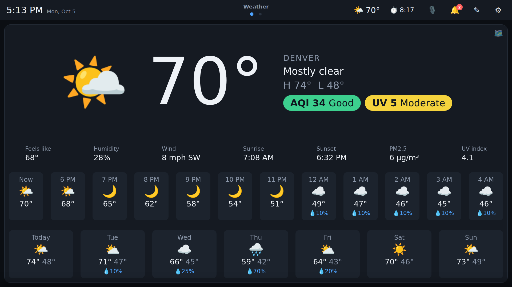 | 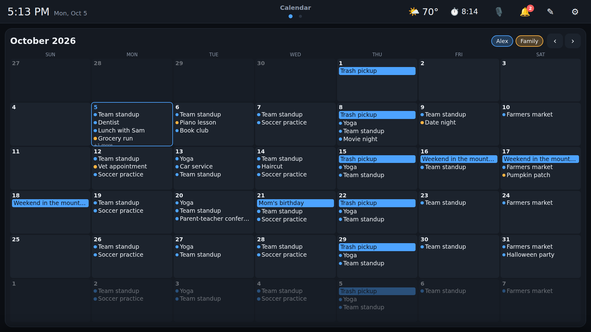 |
| **Weather**: conditions, air quality, UV, hourly and 7-day | **Calendar**: several people's calendars merged, month view |
| 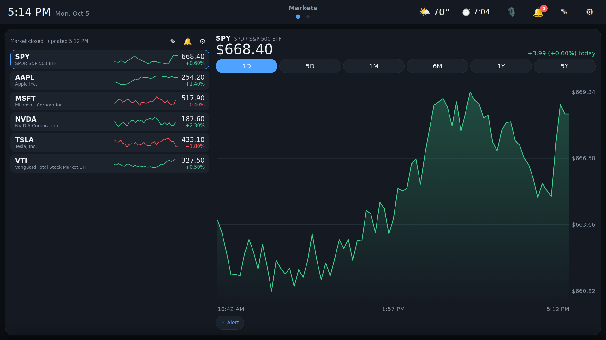 | 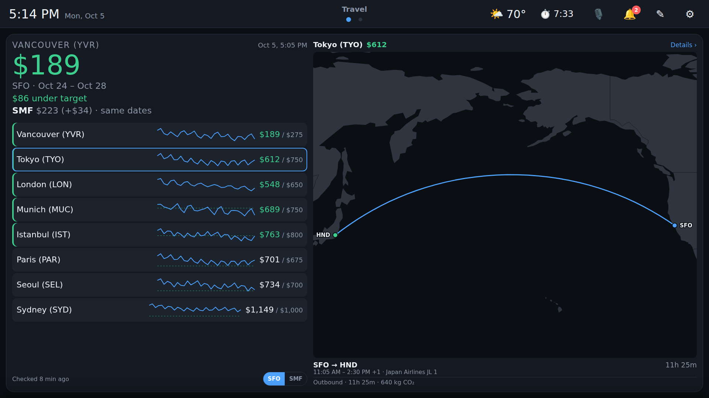 |
| **Stocks**: watchlist, scrub-able charts, price alerts | **Fares**: deals under target with the route on a map |
| 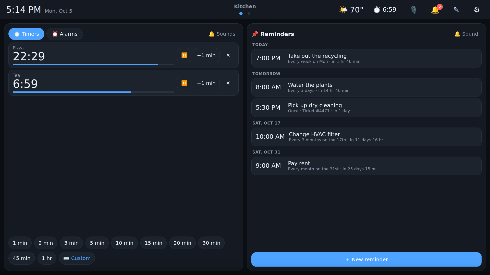 | 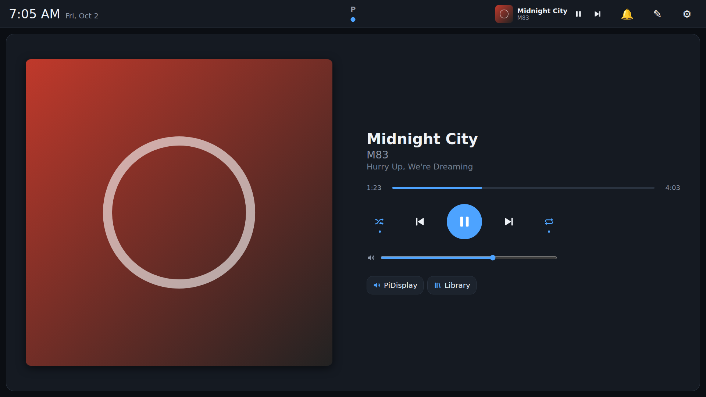 |
| **Timers and reminders** side by side on half-page tiles | **Spotify**: now playing, also shown in the top bar |
| 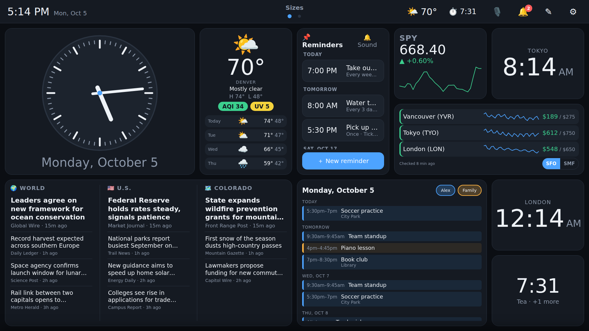 | 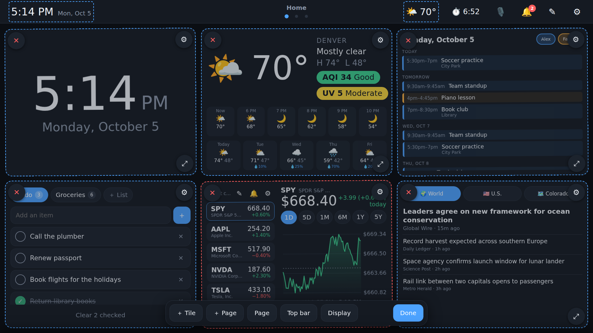 |
| **Mix tile sizes** from 1×1 up to a full page | **Edit mode**: drag, resize, configure, add pages |
| 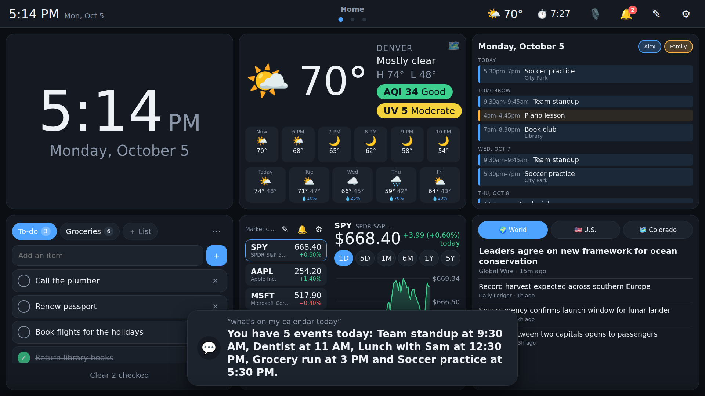 | 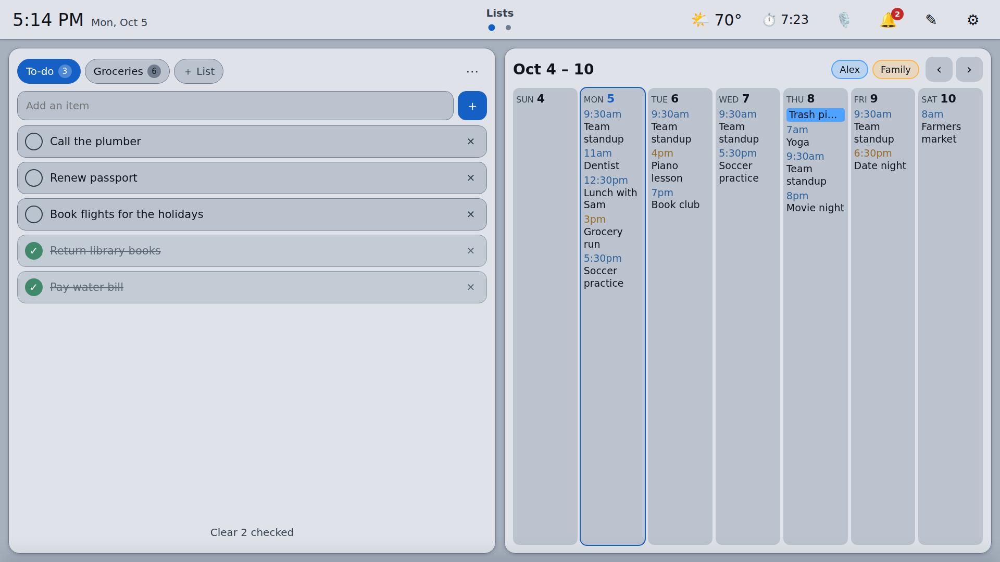 |
| **Voice**: answers on screen and out loud | **Light theme** |

## Hardware

What it was built and tested on:

- Raspberry Pi 4 Model B running 64-bit Raspberry Pi OS (Bookworm) with the default labwc Wayland desktop
- A 15.6" 1920×1080 USB touchscreen (any touchscreen that shows up as a normal input device works)
- Optional: a USB microphone for voice control, and a monitor with DDC/CI so Sleep can turn the backlight down

The UI is plain HTML, so it also runs in any desktop or phone browser, which is handy for development or for editing the dashboard from the couch.

## Try it locally

You need Node 20.19 or newer.

```bash
git clone https://github.com/DanielShevchyk/pidisplay.git
cd pidisplay
npm install
npm run build       # type-checks and builds the UI into dist/
npm start           # serves it at http://127.0.0.1:8080
```

For development with hot reload, run `npm run dev` and open http://localhost:5173. Run the server tests with `npm test`.

Add `?kiosk` to the URL to hide the mouse cursor, as the Pi does.

### Configuration

| Variable | Default | Meaning |
| --- | --- | --- |
| `PORT` | `8080` | HTTP port |
| `HOST` | `127.0.0.1` | Bind address. Set `0.0.0.0` to edit the dashboard from a phone or laptop on your LAN. The API has no login, so only do this on a network you trust. |
| `PIDISPLAY_DATA` | `./data` | Where the layout and widget data are stored (plain JSON files, easy to back up) |

Weather and news tiles start with no location; enter one in a tile's ⚙ settings and other blank weather tiles follow it. To give every blank tile (and voice answers) a fallback, save it on the display:

```bash
curl -X PUT localhost:8080/api/store/home -H 'Content-Type: application/json' \
  -d '{"location":"Austin, TX","newsLocation":"Austin, TX"}'
```

## Running it on a Raspberry Pi

The [`deploy/`](deploy) folder holds everything the Pi needs:

| File | Purpose |
| --- | --- |
| `update.sh` | Runs on the Pi: installs system packages, runs `npm ci` and the build, installs and restarts the `pidisplay` systemd service, sets up the Spotify receiver and voice control, then relaunches the kiosk. Safe to run again on every update. |
| `pidisplay.service` | systemd unit for the server, with data kept in `~/pidisplay-data` so redeploys never touch it |
| `kiosk.sh` + `labwc-autostart` | Starts full-screen Chromium on the dashboard at login and restarts it if it closes |
| `deploy.ps1` | Redeploys from a Windows laptop: pulls the latest commit, copies it to the Pi over SSH, and runs `update.sh` |
| `calendars.ps1`, `photos.ps1`, `spotify.ps1`, `stocks.ps1` | Helpers that save calendar links, photo albums and API keys on the Pi without putting them in git |

First-time setup on a fresh Pi:

1. Install Raspberry Pi OS (64-bit, with desktop), turn on SSH and desktop autologin, and install Node 22 LTS from NodeSource (the apt version is too old).
2. Copy the repository to `~/pidisplay` and run `deploy/update.sh`.
3. Add the PiDisplay line from `deploy/labwc-autostart` to `~/.config/labwc/autostart` and reboot. The dashboard comes up full screen.

> [!NOTE]
> The deploy files are written for my own setup: the user `dan`, a Pi named `piboy`, and the app in `/home/dan/pidisplay`. Change those names in `deploy/` to match yours before running them.

## Writing a widget

A widget is a folder in `src/widgets/` whose `index.ts` default-exports a `defineWidget({...})` definition. It is picked up automatically on the next build. Settings declared in the definition get a form in edit mode for free, and widgets get server-backed storage, notifications and live server events through their context.

```ts
export default defineWidget({
  type: 'hello',
  name: 'Hello',
  description: 'Greets someone',
  icon: '👋',
  sizes: ['small', 'medium'],
  defaultSize: 'small',
  defaultConfig: { name: 'world' },
  settings: [{ key: 'name', label: 'Name', type: 'text' }],
  mount(el, { config }) {
    el.textContent = `Hello, ${config.name}!`;
  },
});
```

The full contract, with storage, sizes and the top bar, is in [docs/WIDGETS.md](docs/WIDGETS.md).

## Notifications from anywhere

Anything that can reach the server can pop a toast on the display and add it to the bell:

```bash
curl -X POST localhost:8080/api/notifications -H 'Content-Type: application/json' \
  -d '{"title":"Laundry is done","body":"Dryer finished at 7:42 PM","source":"Home","level":"success"}'
```

`level` is `info`, `success`, `warning` or `alert`.

## Project layout

```
src/main.ts          Boots the app (retries until the server is up)
src/core/            The shell: widget contract, pages and grid, edit mode, top bar, sheets, theme
src/widgets/<id>/    One folder per widget
server/              Zero-dependency Node server, one module per feature, with tests
voice/               Offline voice service (openWakeWord, Vosk, Piper)
farewatcher/         Daily cheap-fare watcher that feeds the Fares widget
deploy/              Pi setup, systemd units, kiosk launcher, laptop deploy scripts
docs/                Widget guide and per-feature setup notes
```

| Part | What | Why |
| --- | --- | --- |
| UI | Vanilla TypeScript and CSS, bundled by Vite | No framework runtime, fast on a Pi 4 |
| Server | `server/server.js`, plain Node with no dependencies | Serves the built UI and a JSON API, polls external services, keeps secrets off the screen |
| Storage | JSON files in `$PIDISPLAY_DATA`, written atomically | Survives reboots and redeploys, easy to back up |
| Live updates | Server-sent events at `/api/events` | Edits, notifications and alarms show up on every screen at once |

<details>
<summary><b>API reference</b></summary>

| Method | Path | Body / notes |
| --- | --- | --- |
| GET / PUT / DELETE | `/api/layout` | The whole dashboard layout. DELETE resets to `server/default-layout.json`. |
| GET / PUT | `/api/store/:key` | Arbitrary JSON per key; used by widgets through `ctx.storage`. |
| GET | `/api/notifications` | Newest first, last 100 kept. |
| POST | `/api/notifications` | `{ "title": "...", "body": "...", "source": "Farewatcher", "level": "info" \| "success" \| "warning" \| "alert" }` |
| DELETE | `/api/notifications[/:id]` | Dismiss one, or all. |
| GET | `/api/weather?location=Austin, TX&units=imperial` | Forecast and US AQI air quality from Open-Meteo (no API key) for a city or `lat,lon`; `units` is `imperial` or `metric`. Cached 10 minutes. `airQuality` is null if that service doesn't answer. Used by the weather widget, whose map view embeds Windy. |
| GET | `/api/news?sections=world,us,state,local&location=Austin, TX` | Headlines from Google News RSS (no API key): the World and U.S. top stories, the state (from a US "City, ST" location) and local news for the city (falls back to a 3-day search when a town's local feed is empty). Each story has `title`, `source`, `time` and `related` coverage from other outlets. Cached 10 minutes; a failing feed keeps its last copy (`stale`) or reports `error` without hiding the others. |
| GET | `/api/system` | Pi health for the System widget: CPU, memory, disk, temperature, clock, throttle/undervoltage flags, network. Unavailable readings are `null`. |
| GET | `/api/fares` | Farewatcher summary (`$PIDISPLAY_DATA/farewatcher.json`, written by `fare_watch.py` after each run), or `{ "available": false }`. |
| GET | `/api/photos?source=all\|local\|google\|<album>` | Photo gallery list: uploaded photos in `$PIDISPLAY_DATA/photos/<album>/` and Google Photos shared albums linked in `$PIDISPLAY_DATA/photos.json` (links never returned). Each photo has `album`, `src` (screen size) and `thumb`; `albums` carries counts and per-album `error`. |
| GET | `/api/photos/image?path=<album/file>&size=full\|thumb` | An uploaded photo shrunk to 1920x1080 (or a 400px square thumbnail) by ImageMagick and cached in `$PIDISPLAY_DATA/photos-cache/`; the original if ImageMagick is missing. |
| GET | `/api/calendar?from=<ms>&to=<ms>&tz=America/Los_Angeles` | Events from the iCal feeds in `$PIDISPLAY_DATA/calendars.json` (secret, never returned), recurring events expanded, at most 62 days per call. Feeds cached 5 minutes. |
| GET | `/api/stocks` | Stocks widget state: watchlist, latest quotes (with a 30-day sparkline), alerts, settings, data source and credits used. The Pi polls prices itself (Twelve Data with a key in `$PIDISPLAY_DATA/stocks-key.json`, else Yahoo Finance) and fires alerts as bell notifications plus a `stocks-alert` event that plays the sound. |
| PUT | `/api/stocks/symbols` · `/api/stocks/settings` | `{ "symbols": ["AAPL", ...] }` · `{ "refreshMinutes", "sound", "volume", "repeats" }`. POST `/api/stocks/refresh` fetches prices now; POST `/api/stocks/test` fires a test alert. |
| POST / PUT / DELETE | `/api/stocks/alerts[/:id]` | `{ "symbol", "kind": "above" \| "below" \| "up" \| "down", "value" (price, or percent for up/down), "repeat": "once" \| "daily", "note", "enabled" }` |
| GET | `/api/stocks/history?symbol=AAPL&range=1d` | Chart points `[[ms, close], ...]` for `1d`, `5d`, `1m`, `6m`, `1y`, `5y`, plus the previous close. Daily closes are saved in `$PIDISPLAY_DATA/stocks-history.json` and extended from live quotes, so only gaps are refetched. |
| GET | `/api/timers` | Timers, alarms and sound settings, plus the Pi's clock (`now`). State is in `$PIDISPLAY_DATA/timers.json`; the server decides when things ring, so they ring on every screen, on any page, after reloads and reboots. Anything overdue by more than 10 minutes (the Pi was off) is reported in the bell as missed instead of ringing. |
| POST | `/api/timers` · `/api/timers/:id/pause` · `resume` · `add` · `restart` · `snooze` · `dismiss` | `{ "durationMs", "label"? }` to start one · `{}` · `{}` · `{ "ms" }` · `{}` · `{}` · `{}`. DELETE `/api/timers/:id` cancels. |
| PUT | `/api/timers/settings` | `{ "snoozeMinutes", "sound", "volume" (0-100), "ringMinutes" (stop ringing after), "fadeIn" }` |
| POST / PUT / DELETE | `/api/alarms[/:id]` | `{ "hour", "minute", "days": [0-6, 0 = Sunday; empty = once], "label", "sound", "enabled" }`, in the Pi's time zone. POST `/api/alarms/:id/snooze` · `dismiss`. |
| GET / POST / PUT / DELETE | `/api/reminders[/:id]` | Reminders: `{ "title", "notes", "date", "hour", "minute", "repeat": "none" \| "hourly" \| "daily" \| "weekly" \| "monthly" \| "yearly", "interval", "days", "until", "sound", "enabled" }`. POST `/api/reminders/:id/done` · `snooze`. The server fires them with a popup and chime on every screen. |
| GET/PUT/POST | `/api/sleep`, `/api/sleep/settings`, `/api/sleep/now`, `/api/sleep/wake` | Screen sleep: status, the awake hours and idle times (saved in `sleep.json`), turn off now, wake. SSE `sleep` tells screens when it changes. |
| POST | `/api/kiosk/exit` | "Exit to desktop" from the gear menu: drops `$XDG_RUNTIME_DIR/pidisplay-desktop` (which `deploy/kiosk.sh` waits on) and closes the kiosk Chromium. The PiDisplay desktop/menu launcher (`deploy/open-dashboard.sh`) or a reboot brings it back. 501 off the Pi. |
| GET | `/api/wifi[?rescan]` | Wi-Fi adapter state, current network and IP, nearby networks, saved networks (nmcli). |
| POST | `/api/wifi/connect` · `disconnect` · `forget` · `power` | `{ "ssid", "password"? }` · `{}` · `{ "uuid" }` · `{ "on" }`. A failed join removes the new profile and rejoins the previous network. |
| GET | `/api/bluetooth` | Controller power and known devices (bluetoothctl). |
| POST | `/api/bluetooth/power` · `scan` · `pair` · `connect` · `disconnect` · `forget` | `{ "on" }` · `{}` (8 s discovery) · `{ "mac" }`. |
| GET | `/api/spotify` | Spotify widget status: Client ID saved, signed in, and whether the PiDisplay receiver (librespot) has been linked. |
| GET | `/api/spotify/login[?return=/path]` · `/api/spotify/callback` | Spotify sign-in (OAuth with PKCE). Redirect URI is `http://127.0.0.1:8080/api/spotify/callback`; tokens stay in `$PIDISPLAY_DATA/spotify.json`. |
| PUT / POST | `/api/spotify/client` | `{ "clientId" }` (or `?clientId=`) saves the Spotify app's Client ID; empty clears it. POST `/api/spotify/logout` signs out. |
| GET | `/api/spotify/player` · `playlists` · `search?q=` | Now playing plus Spotify Connect devices · your playlists · songs, artists, albums and playlists (10 each). |
| POST | `/api/spotify/player/play` · `pause` · `next` · `previous` · `seek` · `volume` · `shuffle` · `repeat` · `transfer` | `{ "contextUri"?, "offsetUri"?, "uris"?, "deviceId"? }` (no device: the active one, else PiDisplay) · `{}` · `{}` · `{}` · `{ "positionMs" }` · `{ "percent" }` · `{ "on" }` · `{ "mode": "off" \| "context" \| "track" }` · `{ "deviceId", "play"? }`. |
| GET | `/api/youtube[?connect]` | YouTube widget state: linked TVs, what the TV is playing (state, position, volume), recently played. `connect` opens the session to the TV so its updates arrive. |
| GET | `/api/youtube/search?q=` · `discover` | Videos from YouTube's web search (no key; a link or video id also works) · TVs on the network that answer DIAL. |
| POST | `/api/youtube/pair` · `link` · `select` | `{ "code" }` from the TV's "Link with TV code" · `{ "udn" }` of a discovered TV (opens YouTube on it if needed) · `{ "id" }` picks which linked TV to use. DELETE `/api/youtube/screens/:id` forgets one, DELETE `/api/youtube/history` clears the history. |
| POST | `/api/youtube/play` · `queue` · `control` | `{ "videoId", "title"?, "channel"? }` plays now · adds to the TV's queue · `{ "action": "play" \| "pause" \| "next" \| "previous" \| "seek" \| "volume", "value"? }`. |
| GET | `/api/audio` | The Pi's sound outputs (PipeWire via `pactl`): display speakers over HDMI, headphone jack, connected Bluetooth speakers, with the default marked. |
| POST | `/api/audio/select` · `volume` | `{ "name" }` makes it the default and moves anything playing to it · `{ "name", "volume" }` (0-100). |
| GET | `/api/voice` | Voice control state: settings, whether the voice service and microphone are working, wake words, example phrases, recent commands. |
| PUT / POST | `/api/voice/settings` · `/api/voice/command` · `listen` · `cancel` | `{ "enabled", "wakeWord", "sensitivity", "speak", "speechVolume", "chime", "duck" }` · `{ "text" }` runs a command as if spoken and returns `{ reply, action?, expectReply }` · tap to talk · stop listening. |
| GET | `/api/events` | SSE stream: `notification`, `notifications-cleared`, `layout`, `store`, `timers`, `reminders`, `reminder-sound`, `stocks`, `stocks-alert`, `sleep`, `spotify`, `youtube`, `voice`. |

</details>

## Security notes

- The API has no login. It binds to `127.0.0.1` by default; only open it to your LAN (`HOST=0.0.0.0`) on a network you trust.
- Calendar links, photo album links, Spotify tokens and API keys live only in the data folder on the Pi. They are never committed and never sent back to the browser.
- `deploy/update.sh` installs a narrow polkit rule (Wi-Fi management for the dashboard user) and a sudoers file limited to unblocking Bluetooth and setting the CPU governor.
